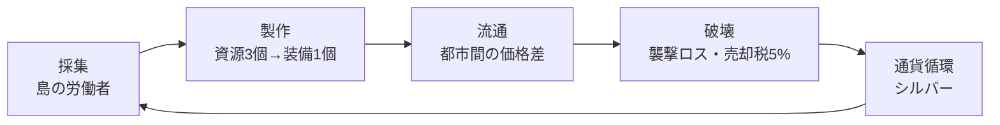

# TollRoad ゲーム設計

## 1. 目的とコンセプト

経済構造（採集 → 製作 → 流通 → 破壊 → 通貨循環）を、60ターンの意思決定ゲームとして体験できるようにする。

プレイヤーは商人となり、都市ごとに異なる相場と、危険な近道の誘惑の間で選択を繰り返す。ゲームの核心は **「安全に少し稼ぐか、リスクを取って大きく稼ぐか」** の反復判断にある。

### 経済循環の対応



「破壊」は、黒ゾーンでの襲撃による積荷の喪失と、売却時に徴収される5%の税（シルバーシンク）の2つが担う。

### 勝利条件

60日を終えた時点の純資産で評価される。

| 純資産 | ランク |
|---|---|
| 1,200,000 以上 | LEGENDARY MERCHANT |
| 500,000 以上 | MASTER TRADER（目標達成） |
| 150,000 以上 | JOURNEYMAN |
| 30,000 以上 | SURVIVOR |
| 30,000 未満 | BANKRUPT |

```
純資産 = 所持シルバー + (積荷 + 島倉庫) の基準価格 × 0.9
```

積荷・島倉庫の評価額は強制換金ではなく、純資産計算上の評価額として算入されるのみ。

## 2. 初期状態

| 項目 | 初期値 |
|---|---|
| 日数 | 1日目 / 全60日 |
| 所持シルバー | 30,000 |
| 現在地 | マートロック |
| 騎乗 | ロバ（積載40） |
| 島レベル | 0（労働者0人） |
| 積荷 | 空 |

## 3. アイテム

### 3.1 資源（重量1）

| 資源 | 基準価格 |
|---|---|
| 鉱石 | 210 |
| 木材 | 205 |
| 繊維 | 200 |
| 皮 | 215 |
| 石材 | 160 |

### 3.2 装備（重量3）

| 装備 | 基準価格 | 材料 |
|---|---|---|
| 剣 | 1,500 | 鉱石 ×3 |
| 弓 | 1,460 | 木材 ×3 |
| ローブ | 1,420 | 繊維 ×3 |
| 革鎧 | 1,480 | 皮 ×3 |

### 3.3 レア品

探索でのみ手に入る。製作の材料にはならず、労働者が運ぶ資源にも含まれない。市場での売買は他の品目と同様に可能。

| レア品 | 基準価格 | 重量 |
|---|---|---|
| 陽光石 | 900 | 1 |
| 古代兵装 | 4,000 | 3 |

## 4. 都市

| 都市 | 特産（安い資源） | 生産ボーナス装備 | 位置 |
|---|---|---|---|
| フォートスターリング | 木材 | 弓 | 環状 0 |
| リムハースト | 繊維 | ローブ | 環状 1 |
| ブリッジウォッチ | 石材 | 革鎧 | 環状 2 |
| マートロック | 鉱石 | 剣 | 環状 3 |
| セットフォード | 皮 | 革鎧 | 環状 4 |
| カーレオン | — | — | 中央（黒ゾーン内） |

5つの王国都市が環状に並び、中央のカーレオンへは黒ゾーンを通らなければ到達できない。

### 4.1 隣接関係

環は閉じている（0 ↔ 1 ↔ 2 ↔ 3 ↔ 4 ↔ 0）。どの王国都市も隣接都市を2つ持つ。

| 都市 | 隣接する2都市 |
|---|---|
| フォートスターリング (0) | リムハースト (1) / セットフォード (4) |
| リムハースト (1) | フォートスターリング (0) / ブリッジウォッチ (2) |
| ブリッジウォッチ (2) | リムハースト (1) / マートロック (3) |
| マートロック (3) | ブリッジウォッチ (2) / セットフォード (4) |
| セットフォード (4) | マートロック (3) / フォートスターリング (0) |

カーレオンはどの王国都市とも王道では接続しておらず、往来は黒ゾーン経由のみ。

## 5. 価格システム

### 5.1 算出式

```
価格 = 基準価格 × 都市補正 × ゆらぎ
ゆらぎ = 0.86 〜 1.16 のランダム値
```

ゆらぎは都市×品目ごとに独立して抽選する。

**都市補正**

| 条件 | 補正 |
|---|---|
| その都市の特産資源 | ×0.72 |
| その都市の生産ボーナス装備 | ×0.88 |
| カーレオンの装備 | ×1.24 |
| カーレオンの資源 | ×1.06 |

### 5.2 更新タイミング

日数が進むたび（移動・製作・引き取り・休息のいずれか）に全都市の価格が再抽選される。

### 5.3 相場メモ

現在地の価格は「既知の相場」として記録され、他都市へ移動しても表示され続ける。ただし記録から7日以上経過すると「古い記録」として薄く表示される。未訪問の都市は「?」。

> **設計意図**：全都市の価格を常時表示すると判断が単純作業になる。記録の鮮度を管理させることで、巡回ルート設計そのものを戦略要素にする。

## 6. アクション

### 6.1 売買（日数消費なし）

- **購入**：所持シルバーと積載空きの範囲内。1 / 5 / 半分 / 全部から数量選択
- **売却**：所持数の範囲内。売却額の5%が税として徴収される（シルバーシンク）

### 6.2 製作（1日消費）

- 資源3個 → 装備1個
- 手数料 90シルバー／個
- 生産ボーナス都市で製作した場合、消費材料の30%が還元される（端数四捨五入）
- 還元は**1個ごとに計算**する（3 × 0.3 = 0.9 → 四捨五入で1個還元 → 実質2個消費）。個数をまとめて指定できるが、消費する日数は1日のみ

### 6.3 移動

| 経路 | 日数 | 費用 | 襲撃率 |
|---|---|---|---|
| 王道・隣接都市 | 1日 | 250 | 0% |
| 王道・非隣接都市 | 2日 | 450 | 0% |
| 黒ゾーン（カーレオン発着） | 1日 | 400 | 22% |

黒ゾーンはどの王国都市からカーレオンへ向かう場合も、またその逆も一律の条件となる。

**襲撃時**：積荷を全て失う。シルバーと島倉庫の資源は失われない。

### 6.4 島倉庫からの引き取り（1日消費）

島倉庫に貯まった資源を、積載量の上限まで積荷に移す。

### 6.5 休息（1日消費）

何もせず1日を送る。相場が動き、労働者は働く。所持シルバーが移動費に満たない場合でも、休息は常に選択できる（ゲームオーバーにはしない）。

### 6.6 探索（1日消費）

現在地に応じてモンスター討伐か遺跡探索のどちらかの体裁で行う（内部ロジックは共通で、都市ごとに演出が変わるだけ）。新しい地点は増やさず、既存6都市に紐付ける。

**成功率**

```
成功率 = 基本確率 + 装備ボーナス
```

- 基本確率は35%。カーレオンは黒ゾーンの並びで15%下がる（20%）
- 装備ボーナスは積荷にある戦闘装備（剣・弓・ローブ・革鎧。交易用の装備をそのまま兼用する）1個につき+3%。同じ種類は3個まで（種類を跨いで持つ方が伸びる）、ボーナス合計は+30%が上限
- 成功率自体の上限は85%

**成功時の報酬**

- シルバー1,600〜4,000（カーレオンは2.5倍）
- 陽光石2〜6個
- 低確率（王国都市30%、カーレオン70%）で古代兵装1個
- 積載の空きを超える分は積めず、シルバーに換算する
- 5日間、島の労働者の産出が2倍になる

**失敗時のリスク**

積荷にある戦闘装備（剣・弓・ローブ・革鎧）を全て失う。資源は無傷（黒ゾーン襲撃の「積荷全損」とは区別する）。

## 7. 成長要素

### 7.1 島と労働者

| レベル | 拡張費用 | 労働者 |
|---|---|---|
| 0 | — | 0人 |
| 1 | 26,000 | 3人 |
| 2 | 70,000 | 9人 |
| 3 | 180,000 | 20人 |

労働者は毎日、1人につきランダムな資源を2個島倉庫へ運ぶ（5資源から均等に抽選）。プレイヤーが何をしていても自動で進行する（パッシブ収入）。島倉庫の容量は無制限。

### 7.2 騎乗（積載量）

| 騎乗 | 費用 | 積載 |
|---|---|---|
| ロバ | 初期 | 40 |
| 雄牛 | 18,000 | 85 |
| 輸送用マンモス | 60,000 | 170 |

積載量は黒ゾーンで失うリスクの大きさとも直結する。

## 8. 画面構成

| 画面/UI要素 | 内容 | 表示方式 |
|---|---|---|
| HUD | 所持シルバー / 経過日数バー | 常時表示（上部固定） |
| 大陸図 | 6都市を3Dで描画した空間。都市はクリック（レイキャストで都市の柱との距離判定）で選択し、移動確認ダイアログを開く | 画面全体の背景として常時表示 |
| 航海日誌・操作ボタン（休息する／目標／結果を見る） | 行動ログと主要操作 | 左下に常時表示のオーバーレイ |
| 市場 | 現在地の相場ゲージと売買ボタン | サイドパネル |
| 積荷 | 品目別に色分けした積載量バー | サイドパネル |
| 製作所 | レシピと製作ボタン | サイドパネル |
| 相場メモ | 全都市 × 全品目の既知価格テーブル | サイドパネル |
| 島と装備 | 拡張・引き取り・騎乗購入 | サイドパネル |
| 探索 | 現在地の成功率と討伐/遺跡探索ボタン | サイドパネル |

サイドパネルは右端のタブボタンで画面右からスライドして開閉する。同時に開けるのは1つで、開いている状態で同じボタンを押すと閉じる。
