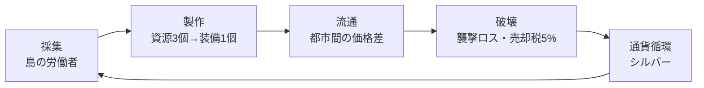

# TollRoad ゲーム設計

## 1. 目的とコンセプト

経済構造（採集 → 製作 → 流通 → 破壊 → 通貨循環）を、60ターンの意思決定ゲームとして体験できるようにする。

プレイヤーは商人となり、都市ごとに異なる相場と、危険な近道の誘惑の間で選択を繰り返す。ゲームの核心は **「安全に少し稼ぐか、リスクを取って大きく稼ぐか」** の反復判断にある。

### 経済循環の対応



「破壊」は、黒ゾーンでの襲撃による積荷の喪失と、売却時に徴収される5%の税（シルバーシンク）の2つが担う。

### 勝利条件

60日を終えた時点の純資産で評価される。

| 純資産 | ランク |
|---|---|
| 1,200,000 以上 | LEGENDARY MERCHANT |
| 500,000 以上 | MASTER TRADER（目標達成） |
| 150,000 以上 | JOURNEYMAN |
| 30,000 以上 | SURVIVOR |
| 30,000 未満 | BANKRUPT |

```
純資産 = 所持シルバー + (積荷 + 島倉庫) の基準価格 × 0.9
```

## 2. 初期状態

| 項目 | 初期値 |
|---|---|
| 日数 | 1日目 / 全60日 |
| 所持シルバー | 30,000 |
| 現在地 | マートロック |
| 騎乗 | ロバ（積載40） |
| 島レベル | 0（労働者0人） |
| 積荷 | 空 |

## 3. アイテム

### 3.1 資源（重量1）

| 資源 | 基準価格 |
|---|---|
| 鉱石 | 210 |
| 木材 | 205 |
| 繊維 | 200 |
| 皮 | 215 |
| 石材 | 160 |

### 3.2 装備（重量3）

| 装備 | 基準価格 | 材料 |
|---|---|---|
| 剣 | 1,500 | 鉱石 ×3 |
| 弓 | 1,460 | 木材 ×3 |
| ローブ | 1,420 | 繊維 ×3 |
| 革鎧 | 1,480 | 皮 ×3 |

## 4. 都市

| 都市 | 特産（安い資源） | 生産ボーナス装備 | 位置 |
|---|---|---|---|
| フォートスターリング | 木材 | 弓 | 環状 0 |
| リムハースト | 繊維 | ローブ | 環状 1 |
| ブリッジウォッチ | 石材 | 革鎧 | 環状 2 |
| マートロック | 鉱石 | 剣 | 環状 3 |
| セットフォード | 皮 | 革鎧 | 環状 4 |
| カーレオン | — | — | 中央（黒ゾーン内） |

5つの王国都市が環状に並び、中央のカーレオンへは黒ゾーンを通らなければ到達できない。

### 4.1 隣接関係

環は閉じている（0 ↔ 1 ↔ 2 ↔ 3 ↔ 4 ↔ 0）。どの王国都市も隣接都市を2つ持つ。

| 都市 | 隣接する2都市 |
|---|---|
| フォートスターリング (0) | リムハースト (1) / セットフォード (4) |
| リムハースト (1) | フォートスターリング (0) / ブリッジウォッチ (2) |
| ブリッジウォッチ (2) | リムハースト (1) / マートロック (3) |
| マートロック (3) | ブリッジウォッチ (2) / セットフォード (4) |
| セットフォード (4) | マートロック (3) / フォートスターリング (0) |

カーレオンはどの王国都市とも王道では接続しておらず、往来は黒ゾーン経由のみ。

## 5. 価格システム

### 5.1 算出式

```
価格 = 基準価格 × 都市補正 × ゆらぎ
ゆらぎ = 0.86 〜 1.16 のランダム値
```

**都市補正**

| 条件 | 補正 |
|---|---|
| その都市の特産資源 | ×0.72 |
| その都市の生産ボーナス装備 | ×0.88 |
| カーレオンの装備 | ×1.24 |
| カーレオンの資源 | ×1.06 |

### 5.2 更新タイミング

日数が進むたび（移動・製作・引き取り・休息のいずれか）に全都市の価格が再抽選される。

### 5.3 相場メモ

現在地の価格は「既知の相場」として記録され、他都市へ移動しても表示され続ける。ただし記録から7日以上経過すると「古い記録」として薄く表示される。未訪問の都市は「?」。

> **設計意図**：全都市の価格を常時表示すると判断が単純作業になる。記録の鮮度を管理させることで、巡回ルート設計そのものを戦略要素にする。

## 6. アクション

### 6.1 売買（日数消費なし）

- **購入**：所持シルバーと積載空きの範囲内。1 / 5 / 半分 / 全部から数量選択
- **売却**：所持数の範囲内。売却額の5%が税として徴収される（シルバーシンク）

### 6.2 製作（1日消費）

- 資源3個 → 装備1個
- 手数料 90シルバー／個
- 生産ボーナス都市で製作した場合、消費材料の30%が還元される（端数四捨五入）
- 還元は**1個ごとに計算**する（3 × 0.3 = 0.9 → 四捨五入で1個還元 → 実質2個消費）。個数をまとめて指定できるが、消費する日数は1日のみ

### 6.3 移動

| 経路 | 日数 | 費用 | 襲撃率 |
|---|---|---|---|
| 王道・隣接都市 | 1日 | 250 | 0% |
| 王道・非隣接都市 | 2日 | 450 | 0% |
| 黒ゾーン（カーレオン発着） | 1日 | 400 | 22% |

黒ゾーンはどの王国都市からカーレオンへ向かう場合も、またその逆も一律の条件となる。

**襲撃時**：積荷を全て失う。シルバーと島倉庫の資源は失われない。

### 6.4 島倉庫からの引き取り（1日消費）

島倉庫に貯まった資源を、積載量の上限まで積荷に移す。

### 6.5 休息（1日消費）

何もせず1日を送る。相場が動き、労働者は働く。

## 7. 成長要素

### 7.1 島と労働者

| レベル | 拡張費用 | 労働者 |
|---|---|---|
| 0 | — | 0人 |
| 1 | 26,000 | 3人 |
| 2 | 70,000 | 9人 |
| 3 | 180,000 | 20人 |

労働者は毎日、1人につきランダムな資源を2個島倉庫へ運ぶ。プレイヤーが何をしていても自動で進行する（パッシブ収入）。

### 7.2 騎乗（積載量）

| 騎乗 | 費用 | 積載 |
|---|---|---|
| ロバ | 初期 | 40 |
| 雄牛 | 18,000 | 85 |
| 輸送用マンモス | 60,000 | 170 |

積載量は黒ゾーンで失うリスクの大きさとも直結する。

## 8. 画面構成

| 画面 | 内容 |
|---|---|
| HUD（固定） | 所持シルバー / 経過日数バー |
| 大陸図 | 6都市のノードマップ。タップで移動確認ダイアログ |
| 積荷 | 品目別に色分けした積載量バー |
| 市場 | 現在地の相場ゲージと売買ボタン |
| 製作所 | レシピと製作ボタン |
| 相場メモ | 全都市 × 全品目の既知価格テーブル |
| 島と装備 | 拡張・引き取り・騎乗購入 |
| 航海日誌 | 行動ログ |
| 休息ボタン | 1日を消費して待機 |

## 未確定事項

実装に着手する前に決める必要がある点。現時点では仕様に記載がない。
各項目をどのマイルストーンの前に決める必要があるかは [roadmap.md](roadmap.md) を参照。

- ~~**Q1 既存コードとの乖離**~~ → **解消**: 初期シルバーは 30,000。`economy_manager.gd` は役割が `GameSession` に移り削除済み。
- ~~**Q2 売却税の課税対象**~~ → **確定**: 売上総額にかかる。手取りは売却額の95%。
- **Q3 島倉庫の容量**: 上限があるか無限か。引き取りは「積載量の上限まで」とあるが、倉庫側の上限は未記載。
- **Q4 労働者の資源分布**: 「ランダムな資源を2個」の抽選が5資源で均等か、重み付きか。
- ~~**Q5 価格のゆらぎの独立性**~~ → **確定**: 都市 × 品目ごとに独立して抽選する。都市間の価格差が日ごとに大きく揺れ、「今日どこが安いか」を探す動機になる。
- ~~**Q6 襲撃の判定単位**~~ → **確定**: 片道につき1度判定する。黒ゾーンは1日移動なので区間は1つしかなく、カーレオンを往復すると計2回判定される（往復とも無事な確率は約61%）。
- **Q7 破産時の扱い**: 所持シルバーが移動費に満たない場合の挙動。ゲームオーバーとするか、休息のみ可能として継続させるか。
- **Q8 60日終了時の積荷**: 純資産に基準価格 ×0.9 で算入されるが、これを強制換金として扱うか、単なる評価額とするか。
