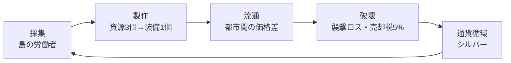

# TollRoad ゲーム設計

## 1. 目的とコンセプト

経済構造（採集 → 製作 → 流通 → 破壊 → 通貨循環）を、60ターンの意思決定ゲームとして体験できるようにする。

プレイヤーは商人となり、都市ごとに異なる相場と、危険な近道の誘惑の間で選択を繰り返す。ゲームの核心は **「安全に少し稼ぐか、リスクを取って大きく稼ぐか」** の反復判断にある。

### 経済循環の対応



「破壊」は、黒ゾーンでの襲撃による積荷の喪失と、売却時に徴収される5%の税（シルバーシンク）の2つが担う。

### 勝利条件

60日を終えた時点の純資産で評価される。

| 純資産 | ランク |
|---|---|
| 1,200,000 以上 | LEGENDARY MERCHANT |
| 500,000 以上 | MASTER TRADER（目標達成） |
| 150,000 以上 | JOURNEYMAN |
| 30,000 以上 | SURVIVOR |
| 30,000 未満 | BANKRUPT |

```
純資産 = 所持シルバー + (積荷 + 島倉庫) の基準価格 × 0.9
```

積荷・島倉庫の評価額は強制換金ではなく、純資産計算上の評価額として算入されるのみ。

## 2. 初期状態

| 項目 | 初期値 |
|---|---|
| 日数 | 1日目 / 全60日 |
| 所持シルバー | 30,000 |
| 現在地 | アイアンホロウ |
| 騎乗 | ロバ（積載40） |
| 島レベル | 0（労働者0人） |
| 積荷 | 空 |

## 3. アイテム

### 3.1 資源（重量1）

| 資源 | 基準価格 |
|---|---|
| 鉱石 | 210 |
| 木材 | 205 |
| 繊維 | 200 |
| 皮 | 215 |
| 石材 | 160 |
| 石炭 | 180 |
| 羊毛 | 195 |
| 水晶 | 260 |
| 粘土 | 150 |

### 3.2 装備（重量3）

| 装備 | 基準価格 | 材料 |
|---|---|---|
| 剣 | 1,500 | 鉱石 ×3 |
| 弓 | 1,460 | 木材 ×3 |
| ローブ | 1,420 | 繊維 ×3 |
| 革鎧 | 1,480 | 皮 ×3 |
| 盾 | 1,350 | 石材 ×3 |
| 戦鎚 | 1,520 | 石炭 ×3 |
| 外套 | 1,440 | 羊毛 ×3 |
| 杖 | 1,750 | 水晶 ×3 |

### 3.3 レア品

探索でのみ手に入る。製作の材料にはならず、労働者が運ぶ資源にも含まれない。市場での売買は他の品目と同様に可能。

| レア品 | 基準価格 | 重量 |
|---|---|---|
| 陽光石 | 900 | 1 |
| 古代兵装 | 4,000 | 3 |

## 4. 都市

| 都市 | 特産（安い資源） | 生産ボーナス装備 |
|---|---|---|
| オークヘイヴン | 木材 | 弓 |
| レンフィールド | 繊維 | ローブ |
| ストーンゲート | 石材 | 盾 |
| アイアンホロウ | 鉱石 | 剣 |
| フォックスミア | 皮 | 革鎧 |
| クラグムーア | 石炭 | 戦鎚 |
| フェンウィック | 羊毛 | 外套 |
| シルバーミア | 水晶 | 杖 |
| ウィンダム | 粘土 | — |
| レイヴンスパイア | — | — |

9つの王国都市が不規則な連結グラフ（王道）を成し、中央のレイヴンスパイアへは黒ゾーンを通らなければ到達できない。

### 4.1 接続関係

王道は環ではなく、都市ごとに隣接数（次数）が異なる不規則なグラフになっている。行き止まりの都市（オークヘイヴン・ウィンダム）は往復での戻りが必要になり、アイアンホロウは4方位につながる最大の交差点になっている。

| 都市 | 王道でつながる都市 | 次数 |
|---|---|---|
| オークヘイヴン | ストーンゲート | 1（行き止まり） |
| ストーンゲート | オークヘイヴン / アイアンホロウ | 2 |
| アイアンホロウ | ストーンゲート / フォックスミア / レンフィールド / クラグムーア | 4 |
| フォックスミア | アイアンホロウ / クラグムーア / シルバーミア | 3 |
| クラグムーア | アイアンホロウ / フォックスミア | 2 |
| レンフィールド | アイアンホロウ / フェンウィック | 2 |
| フェンウィック | レンフィールド / シルバーミア | 2 |
| シルバーミア | フェンウィック / ウィンダム / フォックスミア | 3 |
| ウィンダム | シルバーミア | 1（行き止まり） |

レイヴンスパイアはどの王国都市とも王道では接続しておらず、往来は黒ゾーン経由のみ。**さらに黒ゾーンで直結する（1区間で到達できる）のはアイアンホロウ・フォックスミア・シルバーミアの3都市（黒ゾーンのゲート）だけ**で、それ以外の都市はまず王道でこのいずれかへ着いてから黒ゾーンに入る。移動は最短経路で自動的に複数区間へまたがるため（6.3参照）、ゲートでない都市からレイヴンスパイアへ向かう場合は日数・費用がゲート都市より増えるが、黒ゾーン区間は最後の1区間だけなので襲撃率は22%のまま変わらない。

## 5. 価格システム

### 5.1 算出式

```
価格 = 基準価格 × 都市補正 × ゆらぎ
ゆらぎ = 0.86 〜 1.16 のランダム値
```

ゆらぎは都市×品目ごとに独立して抽選する。

**都市補正**

| 条件 | 補正 |
|---|---|
| その都市の特産資源 | ×0.72 |
| その都市の生産ボーナス装備 | ×0.88 |
| レイヴンスパイアの装備 | ×1.24 |
| レイヴンスパイアの資源 | ×1.06 |

### 5.2 更新タイミング

日数が進むたび（移動・製作・引き取り・休息のいずれか）に全都市の価格が再抽選される。

### 5.3 在庫と需要（生産量・販売数）

市場は無限ではない。都市ごと・品目ごとに**在庫**（買える上限）と**需要**（売れる上限）を持ち、
どちらも毎日その都市の生産量・消費量ぶんだけ補充される。上限は「1日あたりの量 × 4日」。

**生産量**は都市の特産・生産地から決まる（都市ごとの表は持たない）。

| 対象 | 1日の生産量 |
|---|---|
| その都市の特産資源 | 44 |
| その都市の生産ボーナス装備 | 9 |
| その他の資源 | 6 |
| その他の装備 | 2 |
| レア品 | 0（探索でのみ入手） |

**需要**は生産と逆向きで、自前で作れるものは欲しがらない。

| 対象 | 1日の消費量 |
|---|---|
| その都市の特産・生産地の品 | 2 |
| その他の資源 | 8 |
| その他の装備 | 5 |
| レイヴンスパイアの装備 | 14 |
| レイヴンスパイアのその他 | 6 |

**プレイヤーの売買は在庫と需要の両方を動かす。**

| 操作 | 在庫 | 需要 |
|---|---|---|
| 買う | −n（棚から出る） | +n（街から出ていったぶん、また欲しがる） |
| 売る | +n（棚に並ぶ） | −n（買い取り枠を使う） |

売った品はその都市の棚に並ぶので、買い戻すこともできる（在庫の上限までで
頭打ち）。同じ都市で買ってすぐ売り返しても、買値と売値の差・売却税・
掛け率の反応で必ず損になるため、往復で稼ぐことはできない。

> **設計意図**：街に物が出入りしている感触を出す。片側だけ（買うと在庫が減る
> だけ、売ると需要が減るだけ）だと、50個売り込んだ直後の棚が空のままで、
> 自分が売った品を買い戻せない。

在庫と需要は価格にも効く。**買い占めるほど買値が上がり（最大 ×1.15）、
売り込むほど売値が下がる（最小 ×0.88）。** 満杯なら建値どおり。

なお建値そのもの（相場メモが記録する値）は取引では動かさない。動かすと
日をまたいだメモとの整合が取れなくなるため、掛け率は取引の都度かける。

> **設計意図**：同じ都市に同じ品を延々と売り続ける単純作業を防ぐ。特産は1回の来訪で
> 最大の積荷（マンモス170）を満たせる量を確保してあり、「安く仕入れて運ぶ」という
> 遊びの中心は従来どおり成立する。一方、資源をそのまま1都市へ大量に流す戦略は
> 需要の上限で頭打ちになり、製作を挟んで売り先を分散する動機が強くなる。

### 5.4 相場メモ

現在地の価格は「既知の相場」として記録され、他都市へ移動しても表示され続ける。ただし記録から7日以上経過すると「古い記録」として薄く表示される。未訪問の都市は「?」。

> **設計意図**：全都市の価格を常時表示すると判断が単純作業になる。記録の鮮度を管理させることで、巡回ルート設計そのものを戦略要素にする。

## 6. アクション

### 6.1 売買（日数消費なし）

- **購入**：所持シルバー・積載空き・**その都市の在庫**の範囲内
- **売却**：所持数と**その都市の需要**の範囲内。売却額の5%が税として徴収される（シルバーシンク）

在庫・需要は日が変わると補充される（5.3 参照）。売り切れ・買い取り上限に達した品目は
市場画面でボタンが無効になり、理由がツールチップに出る。

### 6.2 製作（1日消費）

- 資源3個 → 装備1個
- 手数料 90シルバー／個
- 生産ボーナス都市で製作した場合、消費材料の30%が還元される（端数四捨五入）
- 還元は**1個ごとに計算**する（3 × 0.3 = 0.9 → 四捨五入で1個還元 → 実質2個消費）。個数をまとめて指定できるが、消費する日数は1日のみ

### 6.3 移動

移動先を選ぶと、現在地からの最短経路をゲームが自動で計算し、複数区間にまたがる場合も1回の操作でまとめて実行する（プレイヤーは経路の途中を意識しなくてよい）。

| 区間の種類 | 日数 | 費用 | 襲撃率 |
|---|---|---|---|
| 王道1区間（直接つながる都市どうし） | 1日 | 250 | 0% |
| 黒ゾーン1区間（ゲート都市⇔レイヴンスパイア） | 1日 | 400 | 22% |

実際の合計日数・費用・襲撃率は、最短経路に含まれる区間の合計になる。たとえば王道2区間なら2日・500・襲撃なし。黒ゾーン区間は発着点の**どちらかがゲート都市（アイアンホロウ・フォックスミア・シルバーミア）である場合のみ**成立する。ゲート都市からレイヴンスパイアへは直接1日・400・襲撃22%。ゲートでない都市からは「王道でゲートまで＋黒ゾーン1区間」の合成になり、日数・費用は増えるが黒ゾーン区間は最後の1つだけなので襲撃率は22%のまま。

**襲撃時**：積荷を全て失う。シルバーと島倉庫の資源は失われない。経路の途中（黒ゾーンを含む区間）で被弾しても、旅程は最終目的地まで続く。

### 6.4 島倉庫からの引き取り（1日消費）

島倉庫に貯まった資源を、積載量の上限まで積荷に移す。

### 6.5 休息（1日消費）

何もせず1日を送る。相場が動き、労働者は働く。所持シルバーが移動費に満たない場合でも、休息は常に選択できる（ゲームオーバーにはしない）。

### 6.6 探索（1日消費）

現在地に応じてモンスター討伐か遺跡探索のどちらかの体裁で行う（内部ロジックは共通で、都市ごとに演出が変わるだけ）。新しい地点は増やさず、既存の全都市に紐付ける。

**成功率**

```
成功率 = 基本確率 + 装備ボーナス
```

- 基本確率は35%。レイヴンスパイアは黒ゾーンの並びで15%下がる（20%）
- 装備ボーナスは積荷にある戦闘装備（剣・弓・ローブ・革鎧・盾・戦鎚・外套・杖。交易用の装備をそのまま兼用する）1個につき+3%。同じ種類は3個まで（種類を跨いで持つ方が伸びる）、ボーナス合計は+30%が上限
- 成功率自体の上限は85%

**成功時の報酬**

- シルバー1,600〜4,000（レイヴンスパイアは2.5倍）
- 陽光石2〜6個
- 低確率（王国都市30%、レイヴンスパイア70%）で古代兵装1個
- 積載の空きを超える分は積めず、シルバーに換算する
- 5日間、島の労働者の産出が2倍になる

**失敗時のリスク**

積荷にある戦闘装備（剣・弓・ローブ・革鎧・盾・戦鎚・外套・杖）を全て失う。資源は無傷（黒ゾーン襲撃の「積荷全損」とは区別する）。

## 7. 成長要素

### 7.1 島と労働者

| レベル | 拡張費用 | 労働者 |
|---|---|---|
| 0 | — | 0人 |
| 1 | 26,000 | 3人 |
| 2 | 70,000 | 9人 |
| 3 | 180,000 | 20人 |

労働者は毎日、1人につきランダムな資源を2個島倉庫へ運ぶ（9資源から均等に抽選）。プレイヤーが何をしていても自動で進行する（パッシブ収入）。島倉庫の容量は無制限。

### 7.2 騎乗（積載量）

| 騎乗 | 費用 | 積載 |
|---|---|---|
| ロバ | 初期 | 40 |
| 雄牛 | 18,000 | 85 |
| 輸送用マンモス | 60,000 | 170 |

積載量は黒ゾーンで失うリスクの大きさとも直結する。

### 7.3 ギルド仲間（同行者）

商人ギルドに登録された9人の仲間から、同時に1人だけを選んで同行させられる。
新規開始時は開始画面（BriefingDialog）でまず1人を選び、以後は開始画面と同じ
選び方をサイドパネルからいつでも無料で行える（日数を消費しない。効果は重複せず、
選んだ1人ぶんのみ有効）。

| 仲間 | 役割 | 効果 |
|---|---|---|
| フィナ | 猫獣人の交渉屋 | 購入価格が8%下がる |
| ガドルフ | ドワーフの老鍛冶 | 製作の手数料が90→60に下がる |
| セラフィーナ | 元貴族の相場読み | 相場メモが古くならない（7日鮮度を無視） |
| ロッコ | 頼れる運び屋 | 積載量+15、黒ゾーンの襲撃率-5pt |
| ケイル | 元斥候・道案内人 | 探索の基本成功率が+5pt上がる |
| ミラ | 目利きの故買屋 | 売却時の税率が5%→2%に下がる |
| バロン | 退役衛兵 | 王道区間の移動費用が250→150に下がる（黒ゾーンは対象外） |
| オルガ | 島の元差配人 | 島の労働者1人あたりの産出が2→3に増える |
| トビアス | 倹約家の職人見習い | 製作の材料所要量が常に1個減る（生産ボーナス都市の還元とも重ねがけ、最低1個） |

上記の1人1特性とは別に、9人全員が5つの基本ステータス（0〜5の段階値）を持つ。
特性を置き換えるものではなく、特性の効果に**加算**される。特性の軸と一致する人
（フィナ/ロッコ/ケイル/ミラ/バロン）はその軸でさらに強くなり、特性の無い人
（ガドルフ/セラフィーナ/オルガ/トビアス）にもこの5軸で存在感が生まれる。

| 基本ステータス | 影響先 | 1レベルあたりの効果 |
|---|---|---|
| 積載量補正 | 積載量 | +1 |
| 交渉力 | 買値の割引 | -1% |
| 目利き | 売却税率の減算 | -1pt（下限0） |
| 探索技能 | 探索成功率 | +1pt |
| 警戒心 | 黒ゾーンの襲撃率の減算 | -1pt（下限0） |

| 仲間 | 積載量 | 交渉力 | 目利き | 探索技能 | 警戒心 |
|---|---|---|---|---|---|
| フィナ | 1 | 5 | 2 | 1 | 1 |
| ガドルフ | 3 | 1 | 1 | 0 | 2 |
| セラフィーナ | 0 | 2 | 4 | 1 | 1 |
| ロッコ | 5 | 1 | 1 | 1 | 3 |
| ケイル | 2 | 0 | 1 | 5 | 2 |
| ミラ | 1 | 3 | 5 | 1 | 0 |
| バロン | 3 | 0 | 1 | 1 | 5 |
| オルガ | 2 | 1 | 2 | 1 | 1 |
| トビアス | 1 | 2 | 2 | 0 | 1 |

この数値は初回の仮置きで、実測（プレイ検証）はしていない。

## 8. 画面構成

| 画面/UI要素 | 内容 | 表示方式 |
|---|---|---|
| HUD | 所持シルバー / 経過日数バー | 常時表示（上部固定） |
| 大陸図 | 全都市を3Dで描画した空間。都市はクリック（レイキャストで都市の柱との距離判定）で選択し、移動確認ダイアログを開く | 画面全体の背景として常時表示 |
| 航海日誌・操作ボタン（休息する／目標／結果を見る） | 行動ログと主要操作 | 左下に常時表示のオーバーレイ |
| 市場 | 現在地の相場ゲージと売買ボタン | サイドパネル |
| 積荷 | 品目別に色分けした積載量バー | サイドパネル |
| 製作所 | レシピと製作ボタン | サイドパネル |
| 相場メモ | 全都市 × 全品目の既知価格テーブル | サイドパネル |
| 島と装備 | 拡張・引き取り・騎乗購入 | サイドパネル |
| 探索 | 現在地の成功率と討伐/遺跡探索ボタン | サイドパネル |
| ギルド仲間 | 同行者の選択・切り替え | サイドパネル |

サイドパネルは右端のタブボタンで画面右からスライドして開閉する。同時に開けるのは1つで、開いている状態で同じボタンを押すと閉じる。
